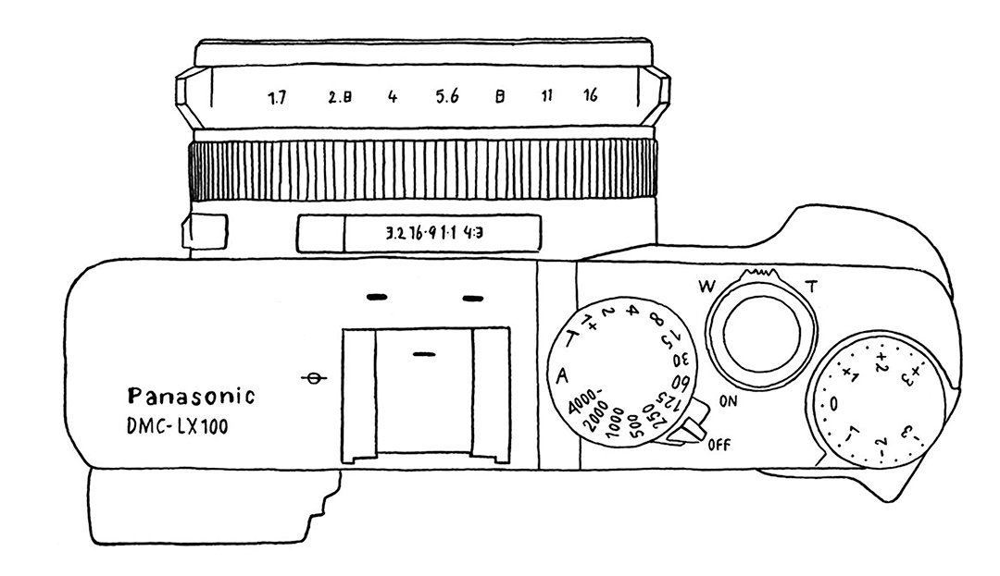

I've got a LX100 years ago. It's little but compact, with physical controls for several camera settings. One of them is the multi-aspect ratio slider. I like taking photo with this function and transfering to phone with the built-in WiFi. While Instagram doesn't support 3:2 ratio, and I'd like to create a layout like [David Hellmann](https://www.instagram.com/davidhellmann/), here this little PWA helps. Try to install it on your phone, or keep it bookmarked.
